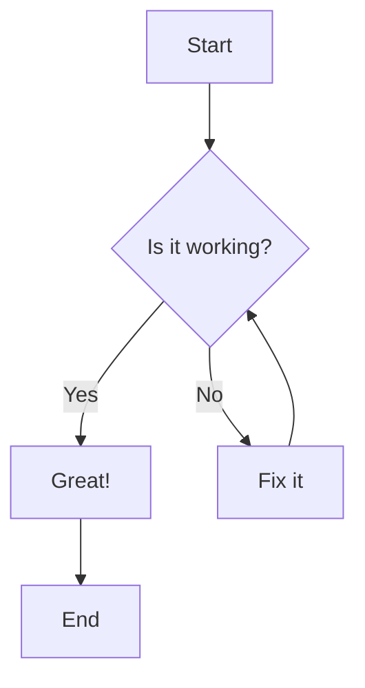
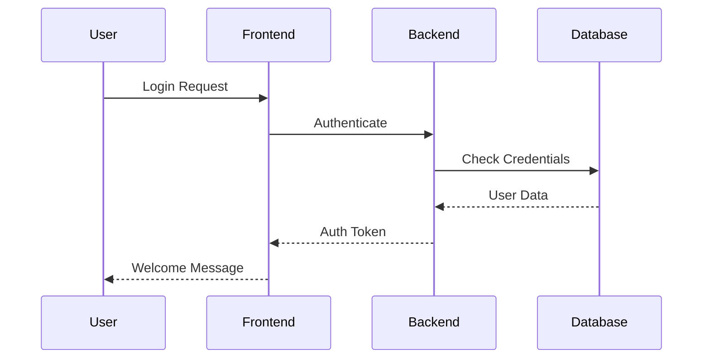
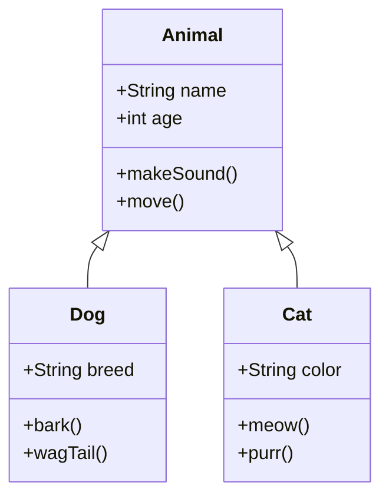
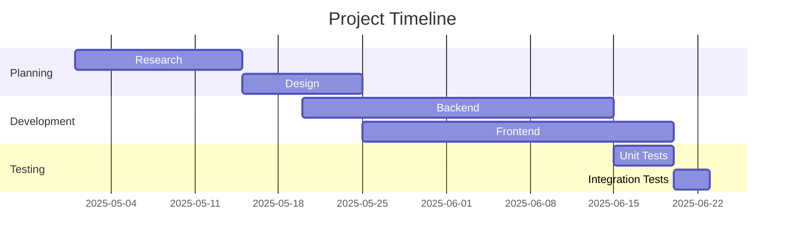

## Basic Images

### Standard Image Syntax


### Reference-Style Images

![Reference image][logo]

![Another reference][screenshot]

[logo]: /assets/favicon-32x32.png "Website Logo"
[screenshot]: /images/screenshot.png "Website Screenshot"

### Images with Links

[](https://example.com)

### Image Sizing (if supported)

{:width="16" height="16"}

{:width="32" height="32"}

## HTML Images for Advanced Control


<figure>
  
  <figcaption>Figure 1: Screenshot of the website homepage</figcaption>
</figure>

## Image Galleries (using HTML)

<div style="display: grid; grid-template-columns: repeat(auto-fit, minmax(150px, 1fr)); gap: 10px; margin: 20px 0;">
  
  
  
  
</div>

## Mathematical Expressions

### Inline Math (LaTeX)

The quadratic formula is $x = \frac{-b \pm \sqrt{b^2 - 4ac}}{2a}$.

Einstein's famous equation: $E = mc^2$.

### Block Math

$$
\begin{align}
\nabla \times \vec{\mathbf{B}} -\, \frac1c\, \frac{\partial\vec{\mathbf{E}}}{\partial t} &= \frac{4\pi}{c}\vec{\mathbf{j}} \\
\nabla \cdot \vec{\mathbf{E}} &= 4 \pi \rho \\
\nabla \times \vec{\mathbf{E}}\, +\, \frac1c\, \frac{\partial\vec{\mathbf{B}}}{\partial t} &= \vec{\mathbf{0}} \\
\nabla \cdot \vec{\mathbf{B}} &= 0
\end{align}
$$

### Complex Mathematical Expressions

$$
\sum_{n=1}^{\infty} \frac{1}{n^2} = \frac{\pi^2}{6}
$$

$$
\int_{-\infty}^{\infty} e^{-x^2} dx = \sqrt{\pi}
$$

## Diagrams and Flowcharts (Mermaid)

### Flowchart



### Sequence Diagram



### Class Diagram



### Gantt Chart



## Embedded Media

### Video Embeds (HTML)

<video width="400" controls>
  <source src="movie.mp4" type="video/mp4">
  <source src="movie.ogg" type="video/ogg">
  Your browser does not support the video tag.
</video>

### Audio Embeds

<audio controls>
  <source src="audio.mp3" type="audio/mpeg">
  <source src="audio.ogg" type="audio/ogg">
  Your browser does not support the audio element.
</audio>

### YouTube Embed

<iframe width="560" height="315" src="https://www.youtube.com/embed/dQw4w9WgXcQ" title="YouTube video player" frameborder="0" allow="accelerometer; autoplay; clipboard-write; encrypted-media; gyroscope; picture-in-picture" allowfullscreen></iframe>

### Twitter Embed

<blockquote class="twitter-tweet">
  <p lang="en" dir="ltr">This is a sample tweet embed</p>
  &mdash; Example User (@exampleuser) <a href="https://twitter.com/exampleuser/status/1234567890">May 28, 2025</a>
</blockquote>

## Interactive Elements

### Collapsible Sections

<details>
  <summary><strong>Click to expand: System Requirements</strong></summary>
  
  <h4>Minimum Requirements:</h4>
  <ul>
    <li>Operating System: Windows 10, macOS 10.15, or Ubuntu 18.04+</li>
    <li>RAM: 8GB minimum, 16GB recommended</li>
    <li>Storage: 2GB available space</li>
    <li>Network: Broadband Internet connection</li>
  </ul>
  
  <h4>Recommended Requirements:</h4>
  <ul>
    <li>Operating System: Latest version of your OS</li>
    <li>RAM: 32GB for optimal performance</li>
    <li>Storage: SSD with 10GB available space</li>
    <li>Network: High-speed broadband connection</li>
  </ul>
</details>

<details>
  <summary><strong>Troubleshooting Guide</strong></summary>
  
  <h4>Common Issues:</h4>
  
  <details>
    <summary>Issue 1: Application won't start</summary>
    <p>Try the following steps:</p>
    <ol>
      <li>Restart your computer</li>
      <li>Check for updates</li>
      <li>Reinstall the application</li>
    </ol>
  </details>
  
  <details>
    <summary>Issue 2: Performance problems</summary>
    <p>Performance can be improved by:</p>
    <ul>
      <li>Closing unnecessary applications</li>
      <li>Increasing available RAM</li>
      <li>Clearing temporary files</li>
    </ul>
  </details>
</details>

## Advanced Formatting

### Keyboard Keys

Press <kbd>Ctrl</kbd> + <kbd>C</kbd> to copy.

Use <kbd>⌘</kbd> + <kbd>Space</kbd> to open Spotlight on Mac.

Navigate with <kbd>↑</kbd> <kbd>↓</kbd> <kbd>←</kbd> <kbd>→</kbd> arrow keys.

### Abbreviations

HTML and CSS are fundamental web technologies.

*[HTML]: HyperText Markup Language
*[CSS]: Cascading Style Sheets

### Footnotes

Here's a sentence with a footnote[^1].

Here's another sentence with a footnote[^note].

Multiple paragraphs footnote[^long-note].

[^1]: This is a simple footnote.

[^note]: This is a footnote with a custom identifier.

[^long-note]: This is a footnote with multiple paragraphs.

    It can contain code blocks, lists, and other formatting.
    
    - Item 1
    - Item 2
    
    ```python
    def footnote_example():
        return "Code in footnotes!"
    ```

### Progress Bars (HTML)

<progress value="32" max="100">32%</progress>

<progress value="75" max="100">75%</progress>

<progress value="100" max="100">Complete!</progress>

### Badges and Labels

<span style="background-color: #28a745; color: white; padding: 2px 6px; border-radius: 3px; font-size: 12px;">✓ Completed</span>

<span style="background-color: #ffc107; color: black; padding: 2px 6px; border-radius: 3px; font-size: 12px;">⚠ Warning</span>

<span style="background-color: #dc3545; color: white; padding: 2px 6px; border-radius: 3px; font-size: 12px;">✗ Error</span>

<span style="background-color: #17a2b8; color: white; padding: 2px 6px; border-radius: 3px; font-size: 12px;">ℹ Info</span>

## Custom Containers and Callouts

### Info Box

<div style="background-color: #e7f3ff; border-left: 4px solid #2196F3; padding: 15px; margin: 20px 0;">
  <strong>💡 Pro Tip:</strong> Always backup your data before making major changes to your system.
</div>

### Warning Box

<div style="background-color: #fff3cd; border-left: 4px solid #ffc107; padding: 15px; margin: 20px 0;">
  <strong>⚠️ Warning:</strong> This operation cannot be undone. Proceed with caution.
</div>

### Error Box

<div style="background-color: #f8d7da; border-left: 4px solid #dc3545; padding: 15px; margin: 20px 0;">
  <strong>❌ Error:</strong> Failed to connect to the database. Check your connection settings.
</div>

### Success Box

<div style="background-color: #d4edda; border-left: 4px solid #28a745; padding: 15px; margin: 20px 0;">
  <strong>✅ Success:</strong> Your changes have been saved successfully!
</div>

## Complex Tables with Media

| Feature | Demo | Status | Notes |
|---------|------|--------|-------|
| **Images** |  | ✅ Working | Supports alt text |
| **Links** | [Documentation](https://example.com) | ✅ Working | External and internal |
| **Code** | `npm install` | ✅ Working | Inline and blocks |
| **Math** | $x^2 + y^2 = z^2$ | ⚠️ Partial | Depends on processor |
| **HTML** | <em>Emphasis</em> | ✅ Working | Most tags supported |

## Responsive Images

<picture>
  <source media="(max-width: 600px)" srcset="/assets/favicon-32x32.png">
  <source media="(max-width: 1200px)" srcset="/assets/apple-touch-icon.png">
  
</picture>

## Image Maps


<map name="imagemap">
  <area shape="rect" coords="0,0,100,100" href="#section1" alt="Section 1">
  <area shape="circle" coords="200,200,50" href="#section2" alt="Section 2">
  <area shape="poly" coords="300,300,400,250,450,350,350,400" href="#section3" alt="Section 3">
</map>

## SVG Graphics

<svg width="200" height="200" xmlns="http://www.w3.org/2000/svg">
  <circle cx="100" cy="100" r="80" fill="#3498db" stroke="#2c3e50" stroke-width="4"/>
  <text x="100" y="110" text-anchor="middle" fill="white" font-family="Arial" font-size="20">SVG</text>
</svg>

## Data Visualization

### Simple Chart (ASCII)

```text
Sales by Quarter
Q1 ████████████████████ 20
Q2 ██████████████████████████████ 30  
Q3 ████████████████████████████████████████ 40
Q4 ██████████████████████████████████████████████████ 50

0    10    20    30    40    50    60
```

### Emoji Charts

📊 **Project Progress:**

Frontend: 🟩🟩🟩🟩🟩🟩🟩🟩⬜⬜ 80%
Backend:  🟩🟩🟩🟩🟩🟩⬜⬜⬜⬜ 60%
Testing:  🟩🟩🟩⬜⬜⬜⬜⬜⬜⬜ 30%
Deploy:   🟥⬜⬜⬜⬜⬜⬜⬜⬜⬜ 0%

🟩 Complete | ⬜ Pending | 🟥 Blocked
